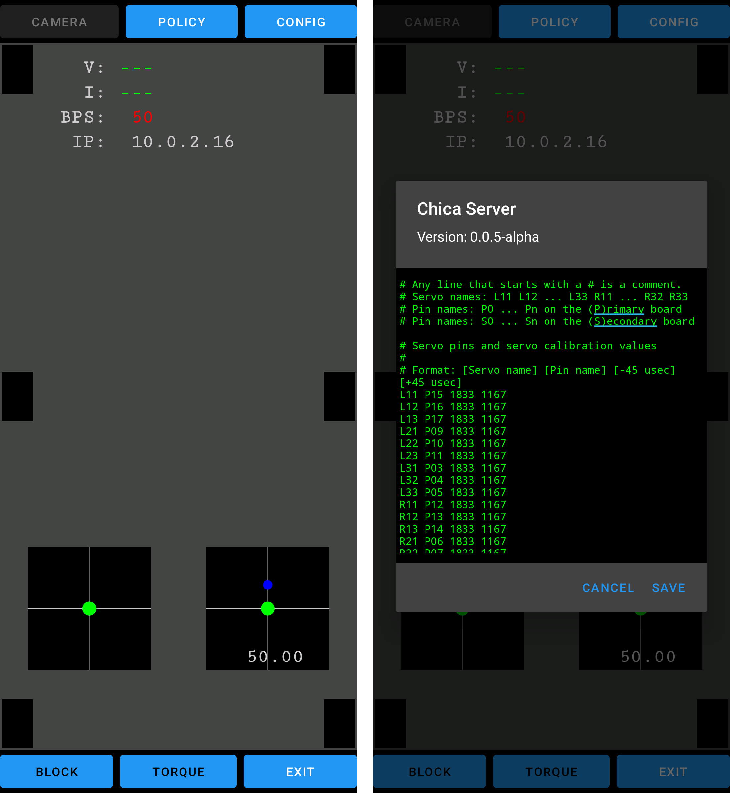

<div align="center">
  
  
</div>
<div align="center"><i>"open source forever"</i></div>

# ChicaServer*
a faithful reconstruction of Chica Server by Make Your Pet, an all-in-one hexapod controller app designed for Chica, Chipo, and other 3DOF hexapods. alongside the reconstructed source, I've included the tools I used to make the process a little easier. if you find issues with the app, open an issue so it can be reviewed and fixed. 

## Overview

ChicaServer turns an Android phone into the brain of a hexapod. the phone runs the
server, drives the legs over USB, reads its own motion sensors for heading, and
takes commands over the network from any client.

```
   ┌──────────┐    TCP / Wi-Fi     ┌───────────────────┐    USB serial     ┌────────────────┐
   │  client  │ ─────────────────► │    ChicaServer    │ ────────────────► │  Servo2040  /  │
   │ (app or  │     port 18711     │  (Android phone)  │     115200 8N1    │  Pololu board  │
   │  script) │ ◄───────────────── │                   │ ◄──────────────── │  → 18 servos   │
   └──────────┘    status lines    └───────────────────┘     telemetry     └────────────────┘
                                       reads phone IMU
                                      (heading / tilt)
```

so there are really two conversations going on, and each gets its own section below:

| layer | how it talks | section |
| :---- | :----------- | :------ |
| client → server | line-based TCP text protocol | [Client Communication](#client-communication) |
| server → hardware | compact USB serial byte protocol | [Hardware Communication](#hardware-communication) |

## Screenshots



## Getting Started

ChicaServer runs on the phone, and the hexapod's control board plugs straight into
that phone.

1. **install the app** grab a release APK (or [build it yourself](#building)) and
   install it on the Android phone that'll live on the robot.
2. **connect the board** plug the Servo2040 or Pololu board into the phone with a
   USB-OTG cable. Android pops up *"Open ChicaServer to handle this USB device?"*
   tap **OK**, and the app launches with USB access and starts serving right away.
3. **connect a client** the phone now listens on TCP port **`18711`** over your
   Wi-Fi. point a controller client at `‹phone-ip›:18711`, or just poke it by hand:

   ```bash
   nc ‹phone-ip› 18711
   # → ready:BPS= 92|V= 7.98|I= 0.25|IP=192.168.1.50|LEGS=------|FLAGS=110000100
   torque        # power the servos
   walk2:0,0.3,0 # walk forward
   walkclear     # stop
   sit           # sit back down
   ```

> [!TIP]
> the board's geometry, servo calibration, pin map, and gait modes all live in
> [`config-2040.txt`](app/src/main/assets/config-2040.txt), and you can edit them
> live from the in-app **CONFIG** dialog. changes are saved to `chica.config`.

## Client Communication

the client talks to the server over a plain-text, line-based **TCP** socket on port
**`18711`** (it binds every interface, so it's reachable over Wi-Fi).

**handshake & flow**

- on connect, the server sends a single **status line** (described below).
- the client sends one **command per line** (`\n`-terminated).
- after each command the server replies with a status line, prefixed by:

  | prefix   | meaning |
  | :------- | :------ |
  | `ready:` | command accepted, server is idle |
  | `busy:`  | rejected because the robot is mid-motion, just send it again |

- `ack` is a no-op poll (handy for reading fresh status or keeping the connection
  alive), and `bye` closes it.

**status line**

```
ready:BPS= 92|V= 7.98|I= 0.25|IP=192.168.1.50|LEGS=------|FLAGS=110000100
```

| field   | meaning |
| :------ | :------ |
| `BPS`   | how many times a second the server polls the board for telemetry, basically the serial round-trip rate to the hardware |
| `V`     | battery voltage (`---` when there's no telemetry) |
| `I`     | current draw in amps |
| `IP`    | the server's own IP address |
| `LEGS`  | per-leg foot contact, 6 chars (`x` = touching, `-` = lifted) |
| `FLAGS` | 9 state digits (see below) |

`FLAGS`, left to right: `relay` · `standing` · `keep` · `crab` · `mode` · `level` ·
`autoSit` · `block` · `calibPosition`. so `110000100` means powered and standing,
in mode 0, with autoSit on.

**command reference**

| group | commands | notes |
| :---- | :------- | :---- |
| power & posture | `torque`, `sit`, `home`, `keep`, `autosit`, `block` | most of these are toggles |
| movement | `walk` · `walk1:` · `walk15:` · `walk2:` · `walk25:` · `walk3:` · `walkwave:`, `walkclear`, `crab` | gait variants plus a stop |
| body pose | `setxy:` · `setzu:` · `setvw:` · `setxyvw:` · `setrotate:` · `setdive:`, `setclear` | translate / rotate the body |
| modes | `standard`, `race`, `offroad`, `custom`, `quad` | leg and gait profiles |
| calibration | `calibpos`, `calibrate` | calibration pose, and auto-calibrate |
| effects | `bounce`, `jump`, `beep`, `level`, `clear` | |
| system | `reboot`, `restart` | restart the service |

the parametric ones take comma-separated values, e.g. `walk2:‹turn›,‹forward›,‹anim›`
and `setxy:‹x›,‹y›`. velocity and pose inputs are unit-scaled, and the body vectors
are clamped to the unit circle, exactly like the original.

## Hardware Communication

the server drives the legs over **USB serial** (CDC-ACM, **115200 8N1**). it
auto-detects the board on launch: a **Pololu** Maestro (by USB vendor/product id) or
a **Servo2040** (RP2040), and it also handles a raw TTY device and a TCP-socket
bridge for developing against the Android emulator.

> permission comes through Android's `USB_DEVICE_ATTACHED` intent: plugging the board
> in launches the app with device access already granted, so there's nothing to tap
> through manually.

**frame protocol**

| command | byte form | purpose |
| :------ | :-------- | :------ |
| `SET` | `0xD3 …` | write servo pulse targets (14-bit ×18) and digital outputs (the power relay) |
| `GET` | `0xC7 ‹pin› ‹count›` | read analog pins; the reply echoes `0xC7 ‹pin› ‹count›` then `count` 14-bit values (`low7`, `high7`) |

**servos** 18 servos, which is 3 joints across 6 legs. a joint angle turns into a
pulse using per-servo calibration (two µs endpoints mapped to a pulse range), all
defined in the config.

**telemetry** (decoded from the raw 14-bit `GET` values):

| reading | conversion |
| :------ | :--------- |
| voltage | `raw / 310.3` |
| current | `(raw − 512) × 0.0814` |
| foot touch | `raw / 1024` (contact when `> 0.5`) |

**power** a digital-output pin gates servo power through a relay (that's what
`torque` flips). as a safety net the firmware cuts torque whenever the battery drops
below 5 V.

**heading** the phone fuses its own gravity and magnetometer readings into an
orientation vector (this is where the on-screen heading comes from), so the robot knows
which way it's facing without any extra hardware.

## Building

you'll need **Android Studio** (or a standalone Gradle + Android SDK), **JDK 17+**,
**Android SDK 33**, and the **NDK** for the native gait / inverse-kinematics module.

```bash
# debug APK
./gradlew :app:assembleDebug
# → app/build/outputs/apk/debug/app-debug.apk

adb install -r app/build/outputs/apk/debug/app-debug.apk
```

the `tools/` directory has the Python harnesses I used during the reconstruction:
`capture/` pulls reference traces off the original, `oracle/` diffs the rebuild
against them, and `device/` holds the board protocol model, the fakes, and the serial
bridge. handy if you ever want to validate a change against the captured traces.

> [!NOTE]
> the original app bundled Google's ML Kit / face-detection models for its camera
> features. those are proprietary, so they've been stripped from this repo to avoid
> redistributing them, the reconstruction doesn't use them, and nothing here depends
> on them.

## Chica Client when?
likely never, the Chica Client app doesn't really do much that you can't do externally, all it does is send commands via the TCP connection. if enough people want it, I might consider working on it.

## License

GNU General Public License, version 3 or later. see [LICENSE](LICENSE).

***
*but open source
